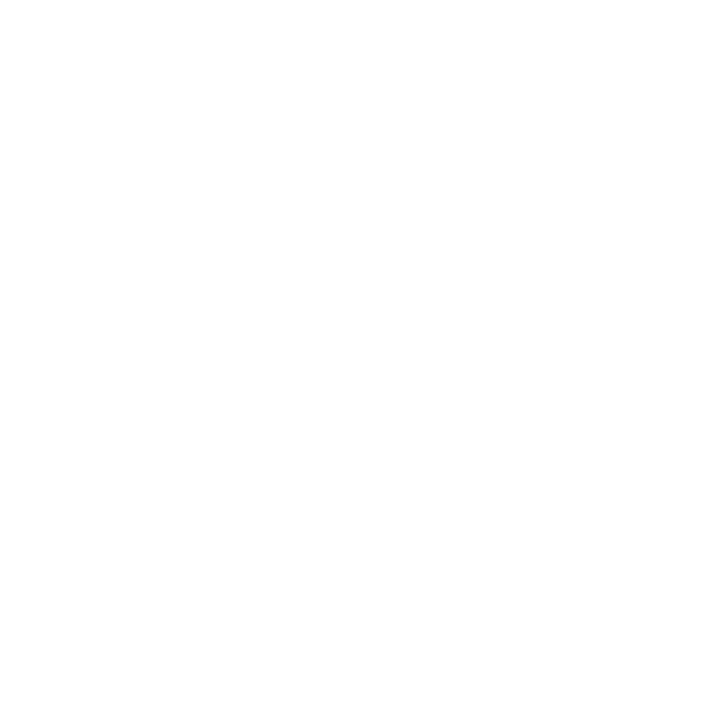

> **MonoCode Linux — interface desktop para seus agentes de código, exclusiva para Linux.**
> Mantido por [yanhenrique-dev](https://github.com/yanhenrique-dev) · Builds `.deb` + AppImage · Licença [MIT](LICENSE).

<p align="center">
  
</p>

<h1 align="center">MonoCode Linux</h1>

<p align="center">
  <strong>A desktop UI for your coding agents — Linux only.</strong>
</p>

<p align="center">
  
</p>

Works with your subscriptions on Claude Code, Codex, Cursor, Grok Build, OpenCode, Pi, omp, fx, and Hermes Agent. If they’re installed and logged in, MonoCode can run them. Tabs are sessions. The composer is the input. MonoCode does not sell tokens.

> 📘 Usuário Linux? Comece por **[docs/linux.md](docs/linux.md)** — guia de instalação, dependências, build `.deb`/AppImage e solução de problemas.

## Install

> Install and log in to at least one provider first:
>
> - [Claude Code](https://claude.com/product/claude-code) - `claude auth login`
> - [Codex](https://developers.openai.com/codex/cli) - `codex login`
> - [Cursor CLI](https://cursor.com/cli) - `agent login`
> - [Grok Build](https://docs.x.ai/build/overview) - `curl -fsSL https://x.ai/cli/install.sh | bash` then `grok login`
> - [OpenCode](https://opencode.ai) - `opencode auth login`
> - [Pi](https://pi.dev/) - `npm install -g @earendil-works/pi-coding-agent`
> - [omp](https://omp.sh) - `curl -fsSL https://omp.sh/install | sh`
> - [fx](https://fx.sh) - `curl -fsSL https://fx.sh/setup.sh | bash` then `fx login`
> - [Hermes Agent](https://github.com/NousResearch/hermes-agent) - Linux: `curl -fsSL https://hermes-agent.nousresearch.com/install.sh | bash`, then run `hermes model`

Linux (x86_64): download the `.deb` or AppImage from [GitHub Releases](https://github.com/yanhenrique-dev/Monocode-linux/releases/latest). Install the `.deb` with `sudo apt install ./MonoCode_*.deb`, or make the AppImage executable with `chmod +x MonoCode_*.AppImage` and run it directly.

## About this project

- **O que é:** interface desktop para agentes de código (Claude Code, Codex, Cursor, Grok Build, OpenCode, Pi, omp, fx, Hermes Agent), exclusiva para Linux.
- **Mantenedor:** [yanhenrique-dev](https://github.com/yanhenrique-dev).
- **Distribuição:** pacotes `.deb` e AppImage via [GitHub Releases](https://github.com/yanhenrique-dev/Monocode-linux/releases/latest), com guia em [docs/linux.md](docs/linux.md).
- **Licença:** [MIT](LICENSE). Provider names and logos are trademarks of their owners - see [NOTICE](NOTICE).

## Some notes

This is very early and you should expect bugs.

Small, focused pull requests are welcome. Anything large is worth an issue first - see [CONTRIBUTING.md](CONTRIBUTING.md).

## Build from source

Linux only (x86_64).

Need Node.js 20+ and a current stable Rust toolchain, plus the standard Tauri prerequisites (e.g. `libwebkit2gtk-4.1-dev`, `libgtk-3-dev`, `libsoup-3.0-dev`, `libjavascriptcoregtk-4.1-dev`).

```bash
npm install
npm run tauri dev
```

### Ubuntu / Debian packages

On an Ubuntu/Debian workstation, the repository can install the native Tauri prerequisites and build distributable Linux packages directly:

```bash
npm run setup:linux:deb
npm ci
npm run build:linux
```

The Linux build emits `.deb` and AppImage bundles under `target/release/bundle/`.
Tauri loads `src-tauri/tauri.linux.conf.json` automatically for Linux development and builds.
Full details: [docs/linux.md](docs/linux.md).

## Project layout

- `src/chrome/` — window frame: title bar, sidebar, composer, tabs, model picker
- `src/surfaces/` — panes inside a tab: transcript, file editor, diff, terminal
- `src/app/` — app-level hooks (sessions, tabs, composer, orchestration)
- `src/lib/` — shared libs (`harness/` has one adapter per provider)
- `src-tauri/src/` — Rust side: PTYs, filesystem/git, session storage, native window
- `scripts/` — helpers (`install-linux-deps-debian.sh` for Ubuntu/Debian)
- `docs/` — guides (`linux.md` is the Linux entry point)
- `.github/workflows/` — CI (`ci.yml`) + release (`release.yml`)

## License

[MIT](LICENSE). Provider names and logos are trademarks of their owners - see [NOTICE](NOTICE).
